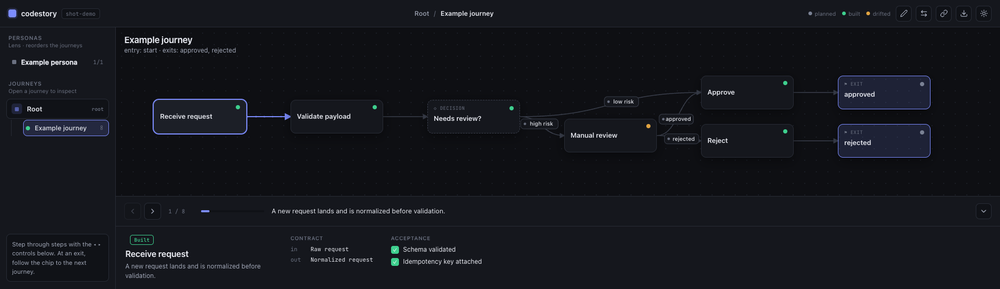

# codestory

**Living storyboards for codebases.** Boards are flows — a sequence of steps, decisions, and exits. Boards chain into end-to-end journeys by wiring one board's exit **ports** to another board's entries. Agents keep the boards in sync with the code they describe, and a local viewer presents them.



## Quickstart

```bash
npx @particular-labs/codestory init      # scaffold .codestory/ with an example board
npx @particular-labs/codestory validate   # parse + referential checks (exit 0 = clean)
npx @particular-labs/codestory present     # serve the viewer at http://localhost:4747
```

Requires Node >= 20. `present --no-open` skips launching the browser; `--port` changes the port.

## How it works

- **`.codestory/codestory.json`** — the manifest: project name + named journeys (entry lenses into the graph).
- **`.codestory/<id>.board.json`** — one board per flow: `nodes` (step / decision / exit), `edges`, declared `entries` / `exits`, and `links` that connect an exit port to another board's entry.
- **`validate`** enforces the contract: links/journeys point at real boards and entries, exit nodes use declared ports, `built` nodes carry tests, `refs` resolve on disk, ids are unique, and variant boards keep the same ports as their base.

## Schema

The zod schemas in [`src/schema.ts`](./src/schema.ts) are the source of truth for the manifest and board formats (`codestory/manifest.v0`, `codestory/board.v0`).

## License

MIT © Particular Labs
